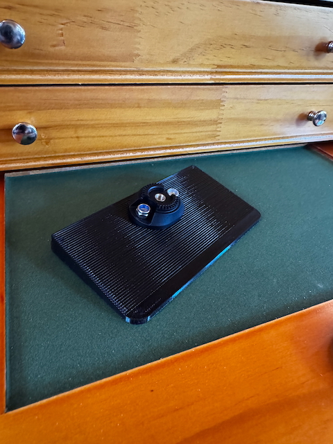

# Quadlock Mount for DJI Drone Controller

Phone Mount for the DJI Controllers using a QuadLock adapter. I had a problem with having to remove
my Quadlock case from my phone in order to use it with the DJI drone controllers. I found a few solutions on [Printables](https://www.printables.com), but found the 3D printed Quadlock receiver too fragile and easily broken. I had a Quadlock lever head
and small concealed base leftover from previous mount projects. So, I built around the components I had on hand. It's a bit overkill, but gets the job done.

## Bill of Materials

This project uses the following components:

- [Quad Lock 360 Head - Lever Head](https://www.quadlockcase.com/collections/quad-lock-360/products/quad-lock-360-head-lever)
- [Quad Lock 360 Base - Concealed Small](https://www.quadlockcase.com/collections/quad-lock-360/products/quad-lock-360-base-concealed-small?variant=42906210566315)

## Dependencies and Building the 3D Model

This model is built using the tools listed below. Install these tools and you can open up the SCAD file in this repo to create your own printable object.

- [OpenSCAD](https://openscad.org)
- [The Belfry OpenScad Library, v2.0.](https://github.com/BelfrySCAD/BOSL2)

## Printing the Mount and Assembly

1. Print the mount base.  I used PETG and the "strength" settings in the slicer (25% infill with 6 perimeters).  I enabled supports for the bottom inset for the bolts that hold the Quadlock base.
2. Attach the _Concealed Small Base_ to the printed part using two bolts.

3. Attach the _Leaver Head_ using the provided screw with the lever oriented perpendicular to the long edge of the printed part.

That's all there is to it.  Insert it into your drone controller as if it was a phone, and attach your phone to the Quadlock
head.

